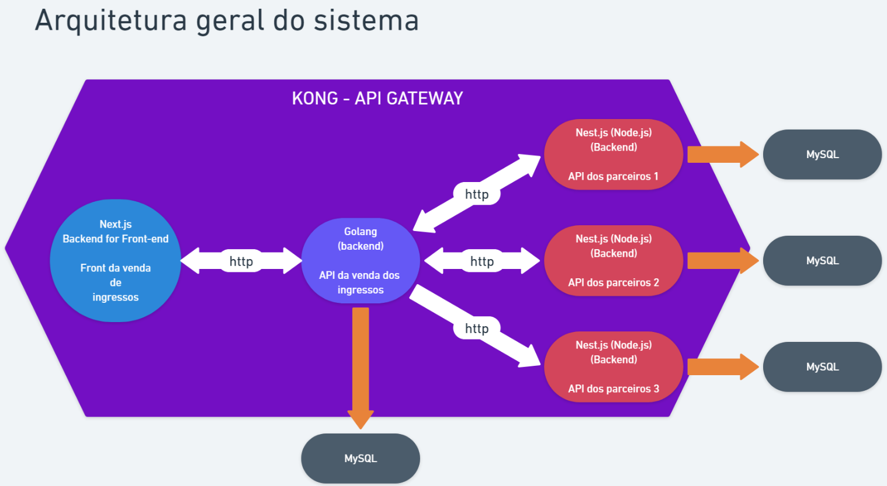
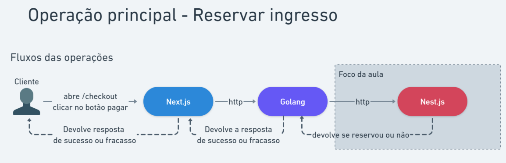

# **Ticket - Sistema de Venda de Ingressos**

Desenvolvido durante a Imersão Fullcycle 18.






## Executando projeto

Na raíz do projeto existe um docker-compose.yaml, configurado para executas todos outros docker-compose interno de cada sub-projeto, basta executá-lo com:

```
docker compose up -d
```

Em seguida vamos executar cada aplicação em seus devidos containers. Nesta etapa deve-se executar cada container em uma nova aba de terminal.

### Golang

```
docker compose exec golang sh
```

Executar sistema de gestão de eventos(Go)

```
go run cmd/events/main.go
```

### NestJS

```
docker compose exec nestjs bash
```

Instalar dependências

```
npm install
```

Executar migrations no banco de dados do sistema de parceiro 1 e 2 respectivamente

```
npm run migrate:partner1
npm run migrate:partner2
```

Geração de dados mockados para test

```
npm run start partner1-fixture
npm run start partner2-fixture
```

Executar sistema de Partner 1

```
npm run start:dev
```

Executar sistema de Partner 2 (em nova aba)

```
docker compose exec nestjs bash
npm run start:dev partner2
```

### Next.js

```
docker compose exec nextjs bash
```

Instalar dependências

```
npm install
```

Executar Front-End

```
npm run dev
```

## Acessando sistema

Com cada projeto já executando em seu devido container, com o Kong, podemos acessar http://localhost:8000/nextjs. A partir dessa url acessamos o front-end web, as demais rotas já estão definidas e configuradas. É possível analisar as configurações de API Gateway com o Kong Manager em http://localhost:8002.

